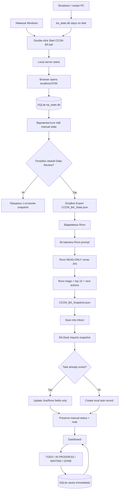

# CCON BA Desk

Локальний персональний BA dashboard для CCON: **Python + SQLite + Rovo**, без запису назад у Jira.

> **Ключове правило:** Jira для цього інструмента тільки **read-only**. BA Desk і Rovo не повинні змінювати Jira status, comments, description, assignee або створювати/редагувати Jira tasks.

## Що це за система

CCON BA Desk розділяє роботу на три незалежні частини:

1. **Jira** — source of truth для фактичних задач.
2. **Rovo** — один раз на день або за потреби аналізує Jira й готує ranked snapshot з next actions.
3. **BA Desk + SQLite** — твій постійний локальний workspace: ручний статус, нотатки, DONE/WAITING/IN PROGRESS та історія не зникають після перезапуску.

Rovo **не є самим dashboard** і не зберігає твій локальний стан. Він лише генерує свіжий файл `CCON_BA_Snapshot.json`.

## Де саме в flow використовується Rovo

Rovo запускається **після старту BA Desk, коли потрібне свіже Daily Review**.

Типовий сценарій:
- зранку запускаєш BA Desk;
- за бажанням експортуєш `CCON_BA_State.json`, щоб Rovo бачив твої локальні статуси/нотатки;
- відкриваєш Rovo;
- вставляєш prompt з секції **Rovo prompt** нижче;
- за потреби додаєш `CCON_BA_State.json`;
- Rovo читає Jira, нічого в Jira не змінює, та повертає JSON;
- зберігаєш його як `inbox/CCON_BA_Snapshot.json`;
- BA Desk автоматично імпортує snapshot і merge-ить його з твоїм SQLite state.

Якщо Rovo сьогодні не запускати, BA Desk все одно відкриється з останнім збереженим станом у SQLite.

## Візуалізація всього flow



## Архітектура даних

```text
Jira
  │
  │ read-only
  ▼
Rovo
  │
  │ CCON_BA_Snapshot.json
  ▼
BA Desk
  │
  ├── Jira/Rovo state
  │     summary
  │     Jira status
  │     priority
  │     AI status
  │     waiting on
  │     blocking
  │     next action
  │     ready output
  │
  └── Your local state
        manual status
        note
        task position
        done / active state
              │
              ▼
        ba_state.db (SQLite)
```

**Новий snapshot оновлює AI/Jira частину, але не повинен стирати твої ручні рішення.**

## Щоденний flow

### 1. Запустити BA Desk

Двічі клацни:

`Start CCON BA.bat`

Відкриється:

`http://localhost:8765`

Сервер читає існуючий `ba_state.db`, тому після перезапуску комп'ютера стан відновлюється.

### 2. Зробити Daily Review через Rovo

Це момент, коли ти пишеш Rovo.

Запусти prompt нижче. Якщо хочеш, щоб Rovo врахував твої manual statuses і notes, перед цим експортуй `CCON_BA_State.json` з dashboard і додай його до Rovo як контекст.

### 3. Зберегти snapshot

Rovo повинен повернути **тільки JSON**.

Збережи його як:

`inbox/CCON_BA_Snapshot.json`

BA Desk перевіряє inbox автоматично кожні кілька секунд і на старті.

### 4. BA Desk merge

Для задач, які вже є в SQLite:
- оновлюються Rovo/Jira fields;
- **manual status не стирається**;
- **personal note не стирається**.

Для нових Jira keys створюється локальний record.

Якщо задача зникла з нового snapshot, вона не видаляється назавжди: її локальний стан зберігається.

### 5. Працювати з dashboard

Ти змінюєш локально:
- `AUTO`
- `IN PROGRESS`
- `WAITING INPUT`
- `WAITING DEPENDENCY`
- `NEEDS DECISION`
- `DONE`

Також можеш додати свою note.

Ці зміни йдуть **тільки в SQLite**.

### 6. Закрити комп'ютер

Нічого спеціального робити не треба.

`ba_state.db` — звичайний файл на диску. Після наступного запуску програма відкриє його з попереднім станом.

## Rovo prompt

Цей самий prompt окремо лежить у `ROVO_PROMPT.txt`.

Він має не просто класифікувати Jira. Для кожної задачі Rovo формує короткий BA Brief: що відбувається, остання meaningful зміна, поверхневий аналіз, факти/гіпотези/unknowns, конкретний next action, покроковий action plan, кого треба контактувати, готовий draft листа/comment/To Do, що робити після наступного кроку і Definition of Done.

```text
You are my daily Business Analyst copilot for CCON.

IMPORTANT SAFETY RULE:
Jira and Confluence are READ-ONLY for this workflow.
Do not change Jira status, comments, description, assignee, priority, links, labels, or create/close/edit issues.
Do not write to Confluence.
You may prepare drafts, To Dos, analysis prompts and recommendations, but never send or apply them.

Return ONLY one valid UTF-8 JSON object suitable for CCON_BA_Snapshot.json.
Do not use markdown fences.
Do not add commentary before or after the JSON.

==================================================
1. SCOPE
==================================================

Use this exact JQL:

project = CCON
AND status != Done
AND assignee = currentUser()
AND (labels IS EMPTY OR labels NOT IN ("blocked"))
AND issuetype != Epic
ORDER BY priority DESC, updated DESC

Analyze EVERY returned issue at least superficially.

The goal is not only to classify tasks.
For every task I must be able to open BA Desk and understand within 20 seconds:

- what is going on;
- what changed recently;
- what I should do next;
- why I should do it;
- who I need to contact, if anyone;
- exactly what I should write, if a message/email is needed;
- what I should check or investigate, if analysis is needed;
- what To Do/specification should be created, if implementation is clear;
- what happens after my next step;
- when my BA work on this task can be considered done.

==================================================
2. TWO-LEVEL ANALYSIS
==================================================

LEVEL A - EVERY ISSUE

For every issue, read enough current context to produce a concise BA brief.

Prefer:
- summary;
- Jira status;
- Jira priority;
- description;
- latest relevant comments;
- latest meaningful activity;
- linked/blocking issues when visible;
- relevant Confluence documentation only when needed to understand the task.

Do not copy long Jira descriptions.
Synthesize the current situation.

LEVEL B - ACTIONABLE / IMPORTANT ISSUES

For issues that are actionable, blocking, need a decision, have new meaningful activity, or are likely to be in today's Focus Queue, inspect deeper context:
- relevant comment thread;
- linked issue state;
- known PNR / Flow ID / request / API context;
- existing supplier conversation;
- existing decisions;
- relevant CCON documentation.

Do NOT perform expensive deep root-cause analysis for every task.
The goal is a useful first-pass BA analysis and a precise next step.

==================================================
3. BA BRIEF FOR EVERY TASK
==================================================

For EVERY issue generate:

taskBrief
- 1-2 short sentences;
- explain the actual business/technical problem in plain language;
- do not simply repeat the Jira summary.

currentSituation
- what is currently known to be happening;
- distinguish fact from assumption.

latestChange
- the latest meaningful event that changed context or next action;
- include date if available;
- include source type: COMMENT | STATUS | LINKED ISSUE | DESCRIPTION | OTHER;
- if there is no meaningful recent change, state that clearly.

surfaceAnalysis
- short first-pass BA interpretation;
- explain what the evidence currently suggests;
- do not present an unverified root cause as fact.

facts
- concise list of verified facts from Jira/Confluence.

hypotheses
- concise list of plausible but unverified explanations.
- empty array if none.

unknowns
- what still needs to be verified before a confident conclusion.

confidence
- HIGH | MEDIUM | LOW
- confidence in the proposed next action, not confidence that the root cause is known.

==================================================
4. STATUS AND PRIORITY
==================================================

aiStatus:

ACTIONABLE NOW
- I can perform a concrete BA action now.

WAITING INPUT
- a question/request has ALREADY been sent and progress now depends on another person/party.

WAITING DEPENDENCY
- progress depends on implementation, release, linked task, certification, another team or technical dependency that is already in motion.

NEEDS DECISION
- a business/product/scope decision is required.

NO FURTHER BA ACTION
- no meaningful BA action is currently required.

waitingOn:
NONE | REPORTER | SUPPLIER | PO | INTERNAL | NOT FOUND

STRICT WAITING RULE:
Do not classify a task as WAITING INPUT merely because somebody should be contacted.

WAITING INPUT requires evidence that the request/question was already sent.

Examples:
- supplier needs to be emailed -> ACTIONABLE NOW, not WAITING SUPPLIER;
- supplier was emailed on 05 Oct and no answer yet -> WAITING INPUT + SUPPLIER;
- reporter still needs to be asked for logs -> ACTIONABLE NOW;
- reporter was already asked and has not replied -> WAITING INPUT + REPORTER.

waitingEvidence
- short evidence for the waiting status;
- include date/person/source if available;
- empty string when waitingOn = NONE.

blocking:
true only when evidence shows another person/team/process cannot continue until this task or a concrete BA action is completed.

blockingReason:
- short factual explanation;
- empty if blocking = false.

aiPriority:

P1 DO NOW
- actionable/decision + blocker/highest priority/blocks active work.

P2 ACTIONABLE
- actionable but not P1.

P3 PLAN
- useful planned BA work, not immediate.

P4 WAITING
- waiting input/dependency.

P5 CLOSE CANDIDATE
- no further BA action appears necessary.

==================================================
5. ROUTING: WHAT KIND OF ACTION IS THIS?
==================================================

Choose exactly one actionType:

EMAIL
- a supplier/airline/external party needs to be contacted.

JIRA_COMMENT
- reporter/internal stakeholder should receive a Jira message or clarification.

INVESTIGATE
- I need to inspect logs, Kibana, request/response, mappings, Swagger, documentation or linked issues.

TODO
- the expected implementation/BA requirement is sufficiently clear and a concrete To Do/specification can be drafted.

DECISION
- PO/business/product decision is needed.

WAIT
- the request/dependency is already in motion and there is no useful action now.

CLOSE_CHECK
- likely no further BA action; verify whether it can be closed/archived.

DEEP_ANALYSIS
- current context is insufficient to choose a safe next action and a dedicated deeper investigation is required.

Use keywords only as ROUTING HINTS, never as facts.

Typical hints:
- PNR, flowId, requestId, response, Kibana, stack trace, Swagger, mapping, serializer -> often INVESTIGATE;
- supplier/airline/NDC behavior, certification, supplier discrepancy -> often EMAIL, but only if supplier contact is actually the next step;
- missing reproduction, expected behavior, examples, logs from reporter -> often JIRA_COMMENT;
- clear mapping/error-code/featureList requirement -> often TODO;
- policy/scope/expected product behavior -> often DECISION.

Always confirm the route against the actual task context.

==================================================
6. NEXT ACTION
==================================================

For every task generate exactly ONE nextAction.

It must be executable and specific.

Bad:
- Investigate issue.
- Contact supplier.
- Check logs.
- Review documentation.

Good:
- Check Kibana for PNR E9DZDD and compare the raw supplier response with the CCON RestPnrResponse segmentList.
- Send the prepared supplier email asking whether code 1135 always represents return-flight sold out.
- Ask Sebastian in Jira for the exact request payload and UTC timestamp.
- Draft the Team A implementation To Do for adding verifyFare to upsellFareList[].featureList.

whyNextAction
- one short explanation of why this is the best next step.

actionPlan
- 1 to 5 short ordered steps that let me immediately start working;
- concrete checks, pages, logs, comparisons or questions;
- do not invent paths, field names or identifiers that are not supported by source context.

afterNextAction
- list the likely next branches.
- use explicit IF -> THEN logic where useful.

Example:
[
  "If raw supplier response contains segmentList -> investigate CCON mapping/serialization.",
  "If raw supplier response does not contain segmentList -> prepare supplier investigation."
]

definitionOfDone
- define what outcome means my BA work for this step/task is complete enough to move forward.

==================================================
7. WHO DO I NEED TO CONTACT?
==================================================

Generate:

contactNeeded: true | false

contactType:
SUPPLIER | REPORTER | PO | INTERNAL | NONE

contactTarget:
- exact person/team/company only if clearly supported by Jira/Confluence;
- otherwise use a safe role such as "Reporter", "Supplier support", "PO", "RedBox team";
- never invent an email address or person.

contactPurpose:
- one sentence explaining what information/decision is needed.

If contactNeeded = false:
contactType = NONE
contactTarget = ""
contactPurpose = ""

==================================================
8. READY OUTPUT
==================================================

If the next action involves communication or a clear implementation To Do, prepare it NOW.

readyOutputType:
EMAIL | JIRA_COMMENT | TODO | DECISION_REQUEST | ANALYSIS_PROMPT | NONE

readyOutputTitle:
- human-friendly label such as:
  "Supplier email to Finnair"
  "Jira comment to reporter"
  "Implementation To Do"
  "Deep-analysis prompt"

readyOutput:
- full ready-to-use draft text;
- empty string only when no useful draft can be produced.

Do not merely say "send an email".
Write the email.

Do not merely say "ask reporter".
Write the Jira comment.

Do not merely say "create To Do".
Draft the To Do with clear implementation points.

Do not claim something was sent or completed.

EMAIL RULES

Body starts with:
Dear Team

Subject:
AER. <descriptive subject> [<numeric Jira issue number>]

Example:
CCON-15005
-> AER. Airtuerk bookings 325 Offer referenced not found [15005]

Do not include AER-internal flow IDs, UUIDs, correlation IDs, execution IDs or internal request IDs in supplier-facing content unless the identifier is explicitly safe/meaningful for that recipient.

Do not invent recipient email addresses.
Do not add a closing signature.

JIRA COMMENT RULES

- professional English;
- concise;
- directly state what is needed or clarified;
- do not mention AI classifications.

TODO RULES

- describe WHAT must change and WHY;
- include acceptance/check points if supported;
- do not invent exact code paths/classes/field names unless they are explicitly supported by Jira/Confluence evidence.

ANALYSIS PROMPT

If actionType = DEEP_ANALYSIS, generate a reusable prompt that states:
- task;
- known facts;
- unknowns;
- exact evidence to inspect;
- expected decision/output.

==================================================
9. CHANGE SINCE LAST REVIEW
==================================================

If CCON_BA_State.json is attached, use it only as my local context.

Do not treat my manual status or note as Jira facts.
Do not overwrite them.

For every task generate:

changedSinceLastReview:
NEW | CHANGED | NO_CHANGE | UNKNOWN

changeSummary:
- one short sentence;
- explain only meaningful change affecting context, priority or next action.

If no previous state is available:
changedSinceLastReview = UNKNOWN
changeSummary = ""

==================================================
10. FOCUS RANK
==================================================

Return every issue from JQL in tasks[].

Also assign:

focusRank:
- integer 1..15 for the 15 most useful tasks to work on now;
- null for all others.

Rank by:
1. blocking actionable work;
2. urgent decisions;
3. meaningful new changes requiring my action;
4. other actionable tasks;
5. planned work.

Ordinary waiting tasks must not occupy Focus Queue positions unless there is a concrete follow-up action today.

==================================================
11. OUTPUT SHAPE
==================================================

Return:

{
  "generatedAt": "ISO-8601 timestamp with timezone",
  "tasks": [
    {
      "key": "CCON-12345",
      "summary": "...",
      "url": "...",
      "jiraStatus": "...",
      "jiraPriority": "...",
      "taskBrief": "...",
      "currentSituation": "...",
      "latestChange": {
        "date": "YYYY-MM-DD or UNKNOWN",
        "source": "COMMENT | STATUS | LINKED ISSUE | DESCRIPTION | OTHER",
        "text": "..."
      },
      "surfaceAnalysis": "...",
      "facts": ["..."],
      "hypotheses": ["..."],
      "unknowns": ["..."],
      "confidence": "HIGH | MEDIUM | LOW",
      "aiStatus": "ACTIONABLE NOW | WAITING INPUT | WAITING DEPENDENCY | NEEDS DECISION | NO FURTHER BA ACTION",
      "aiPriority": "P1 DO NOW | P2 ACTIONABLE | P3 PLAN | P4 WAITING | P5 CLOSE CANDIDATE",
      "waitingOn": "NONE | REPORTER | SUPPLIER | PO | INTERNAL | NOT FOUND",
      "waitingEvidence": "",
      "blocking": false,
      "blockingReason": "",
      "actionType": "EMAIL | JIRA_COMMENT | INVESTIGATE | TODO | DECISION | WAIT | CLOSE_CHECK | DEEP_ANALYSIS",
      "nextAction": "...",
      "whyNextAction": "...",
      "actionPlan": ["..."],
      "afterNextAction": ["..."],
      "definitionOfDone": "...",
      "contactNeeded": false,
      "contactType": "SUPPLIER | REPORTER | PO | INTERNAL | NONE",
      "contactTarget": "",
      "contactPurpose": "",
      "readyOutputType": "EMAIL | JIRA_COMMENT | TODO | DECISION_REQUEST | ANALYSIS_PROMPT | NONE",
      "readyOutputTitle": "",
      "readyOutput": "",
      "changedSinceLastReview": "NEW | CHANGED | NO_CHANGE | UNKNOWN",
      "changeSummary": "",
      "focusRank": null
    }
  ]
}

==================================================
12. QUALITY RULES
==================================================

Before returning JSON, verify:

- every JQL issue is present exactly once;
- every task has a concise BA brief;
- every task has exactly one concrete nextAction;
- actionPlan is actionable, not generic;
- if communication is the next step, a draft is prepared;
- if implementation is clear, a To Do is drafted;
- if investigation is needed, exact checks are listed;
- WAITING is used only when evidence shows a request/dependency is already in motion;
- FACTS, HYPOTHESES and UNKNOWNS are not mixed;
- no unverified root cause is stated as fact;
- no recipient or email address is invented;
- no Jira/Confluence modification is performed;
- max 15 tasks have focusRank;
- JSON is valid and contains no markdown outside string values.
```

## Запуск на Windows

1. Завантаж репозиторій: **Code → Download ZIP**, розпакуй у постійну папку.
2. Двічі клацни **Start CCON BA.bat**.
3. Автоматично відкриється `http://localhost:8765`.
4. Залиш вікно запуску відкритим. Щоб зупинити сервер, натисни `Ctrl+C`.

Потрібен Python 3.10+.

Скрипт перевіряє:
- `py`
- `python`
- потім вбудований Python Codex.

За потреби створи `.python-path` з повним шляхом до `python.exe`.

Альтернативний запуск:

```bash
python server.py --open
```

Якщо порт зайнятий:

```bash
python server.py --port 8766 --open
```

## Перший тест без Jira/Rovo

Скопіюй:

`examples/snapshot.json`

у:

`inbox/CCON_BA_Snapshot.json`

Це **вигадані DEMO задачі**, не Jira data.

Потім:
1. зміни «Мій статус»;
2. додай note;
3. натисни «Зберегти»;
4. перезапусти BA Desk;
5. переконайся, що status і note залишились;
6. імпортуй новіший snapshot;
7. переконайся, що manual state не затерся.

## Де зберігаються дані

- `ba_state.db` — SQLite: оцінки Rovo, manual statuses, notes, inactive/returned tasks.
- `inbox/CCON_BA_Snapshot.json` — останній Daily Review від Rovo.
- `CCON_BA_State.json` — читабельний export локального state, який можна дати Rovo як додатковий контекст.

Для backup:
1. зупини сервер;
2. скопіюй `ba_state.db`.

Для перенесення на інший комп'ютер:
1. скопіюй repo/app;
2. поклади старий `ba_state.db` поруч із `server.py`;
3. запусти BA Desk.

Runtime data і secrets не повинні потрапляти в Git.

## Jira safety

Поточний design принципово **не передбачає write-back у Jira**.

Allowed:
- читати Jira;
- аналізувати Jira;
- відкривати Jira task у браузері;
- готувати draft text;
- копіювати draft вручну.

Not allowed:
- змінювати Jira status;
- додавати comments автоматично;
- редагувати description;
- змінювати assignee/priority;
- створювати/закривати Jira tasks;
- виконувати будь-які Jira write API calls.

## Що буде з Jira API

Наступний можливий крок — додати пряме **read-only Jira API** підключення до BA Desk.

Тоді flow можна буде скоротити:

```text
Jira API (read-only)
        ↓
BA Desk
        ↓
SQLite
```

А Rovo залишити тільки для AI reasoning / daily ranking / next actions.

До цього моменту поточний working flow залишається:

```text
Jira → Rovo → CCON_BA_Snapshot.json → BA Desk → SQLite
```

## Перевірка

```bash
python -m unittest discover -s tests -v
```

Тести перевіряють:
- HTTP import;
- manual changes;
- новий snapshot;
- повторний import;
- missing/returning tasks;
- restart persistence;
- invalid/stale data;
- захист від сторонніх web requests.

Сервер слухає тільки `127.0.0.1`, тобто це локальний single-user tool.
