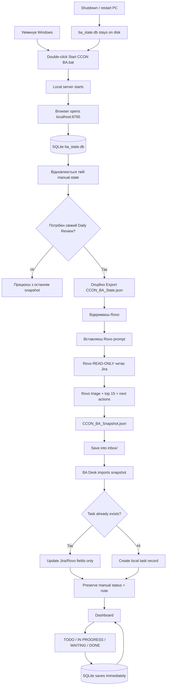

# CCON BA Desk

Локальний персональний BA dashboard для CCON: **Python + SQLite + Rovo**, без запису назад у Jira.

> **Ключове правило:** Jira для цього інструмента тільки **read-only**. BA Desk і Rovo не повинні змінювати Jira status, comments, description, assignee або створювати/редагувати Jira tasks.

## Що це за система

CCON BA Desk розділяє роботу на три незалежні частини:

1. **Jira** — source of truth для фактичних задач.
2. **Rovo** — один раз на день або за потреби аналізує Jira й готує ranked snapshot з next actions.
3. **BA Desk + SQLite** — твій постійний локальний workspace: ручний статус, нотатки, DONE/WAITING/IN PROGRESS та історія не зникають після перезапуску.

Rovo **не є самим dashboard** і не зберігає твій локальний стан. Він лише генерує свіжий файл `CCON_BA_Snapshot.json`.

## Де саме в flow використовується Rovo

Rovo запускається **після старту BA Desk, коли потрібне свіже Daily Review**.

Типовий сценарій:
- зранку запускаєш BA Desk;
- за бажанням експортуєш `CCON_BA_State.json`, щоб Rovo бачив твої локальні статуси/нотатки;
- відкриваєш Rovo;
- вставляєш prompt з секції **Rovo prompt** нижче;
- за потреби додаєш `CCON_BA_State.json`;
- Rovo читає Jira, нічого в Jira не змінює, та повертає JSON;
- зберігаєш його як `inbox/CCON_BA_Snapshot.json`;
- BA Desk автоматично імпортує snapshot і merge-ить його з твоїм SQLite state.

Якщо Rovo сьогодні не запускати, BA Desk все одно відкриється з останнім збереженим станом у SQLite.

## Візуалізація всього flow



## Архітектура даних

```text
Jira
  │
  │ read-only
  ▼
Rovo
  │
  │ CCON_BA_Snapshot.json
  ▼
BA Desk
  │
  ├── Jira/Rovo state
  │     summary
  │     Jira status
  │     priority
  │     AI status
  │     waiting on
  │     blocking
  │     next action
  │     ready output
  │
  └── Your local state
        manual status
        note
        task position
        done / active state
              │
              ▼
        ba_state.db (SQLite)
```

**Новий snapshot оновлює AI/Jira частину, але не повинен стирати твої ручні рішення.**

## Щоденний flow

### 1. Запустити BA Desk

Двічі клацни:

`Start CCON BA.bat`

Відкриється:

`http://localhost:8765`

Сервер читає існуючий `ba_state.db`, тому після перезапуску комп'ютера стан відновлюється.

### 2. Зробити Daily Review через Rovo

Це момент, коли ти пишеш Rovo.

Запусти prompt нижче. Якщо хочеш, щоб Rovo врахував твої manual statuses і notes, перед цим експортуй `CCON_BA_State.json` з dashboard і додай його до Rovo як контекст.

### 3. Зберегти snapshot

Rovo повинен повернути **тільки JSON**.

Збережи його як:

`inbox/CCON_BA_Snapshot.json`

BA Desk перевіряє inbox автоматично кожні кілька секунд і на старті.

### 4. BA Desk merge

Для задач, які вже є в SQLite:
- оновлюються Rovo/Jira fields;
- **manual status не стирається**;
- **personal note не стирається**.

Для нових Jira keys створюється локальний record.

Якщо задача зникла з нового snapshot, вона не видаляється назавжди: її локальний стан зберігається.

### 5. Працювати з dashboard

Ти змінюєш локально:
- `AUTO`
- `IN PROGRESS`
- `WAITING INPUT`
- `WAITING DEPENDENCY`
- `NEEDS DECISION`
- `DONE`

Також можеш додати свою note.

Ці зміни йдуть **тільки в SQLite**.

### 6. Закрити комп'ютер

Нічого спеціального робити не треба.

`ba_state.db` — звичайний файл на диску. Після наступного запуску програма відкриє його з попереднім станом.

## Rovo prompt

Цей самий prompt окремо лежить у `ROVO_PROMPT.txt`.

```text
You are my CCON daily Business Analyst copilot. Do not modify Jira or Confluence.
Return ONLY a valid UTF-8 JSON object suitable for CCON_BA_Snapshot.json, without markdown fences.

Use this exact JQL:
project = CCON AND status != Done AND assignee = currentUser()
AND (labels IS EMPTY OR labels NOT IN ("blocked")) AND issuetype != Epic
ORDER BY priority DESC, updated DESC

Quickly triage every returned issue using summary, status, priority, latest relevant activity and visible dependencies. Rank the top 15 by useful BA action now, then read their detailed context, comments and linked issues. Return those tasks in ranked order. Do not invent facts, addresses or links. If information is missing, say so. Explain waitingOn and aiStatus with concrete source context in statusReason. Prefer actions that I can actually perform. readyOutput should be a useful draft or prompt, explicitly a draft, never a claim that a message has been sent.

The snapshot is the complete daily selected queue. Include generatedAt as the actual current ISO-8601 timestamp with timezone. Every task has:
key: actual CCON-number
summary: string
url: actual Jira URL if available, otherwise omit
jiraStatus: string
priority: string
aiStatus: ACTIONABLE NOW | WAITING INPUT | WAITING DEPENDENCY | NEEDS DECISION | NO FURTHER BA ACTION
waitingOn: NONE | REPORTER | SUPPLIER | PO | INTERNAL | NOT FOUND
statusReason: short explanation with date/source of latest relevant evidence; do not expose unnecessary personal data
blocking: boolean, true only when evidence shows it blocks another task
nextAction: concrete action
readyOutput: draft text or reusable analysis prompt; no invented recipients

Shape:
{"generatedAt":"ACTUAL_TIMESTAMP","tasks":[{"key":"ACTUAL_CCON_KEY","summary":"...","jiraStatus":"...","priority":"...","aiStatus":"...","waitingOn":"...","statusReason":"...","blocking":false,"nextAction":"...","readyOutput":"..."}]}

If I attach CCON_BA_State.json, consider my manualStatus and note as context. Do not overwrite or reinterpret my decisions as Jira facts. The local app preserves these fields separately.
```

## Запуск на Windows

1. Завантаж репозиторій: **Code → Download ZIP**, розпакуй у постійну папку.
2. Двічі клацни **Start CCON BA.bat**.
3. Автоматично відкриється `http://localhost:8765`.
4. Залиш вікно запуску відкритим. Щоб зупинити сервер, натисни `Ctrl+C`.

Потрібен Python 3.10+.

Скрипт перевіряє:
- `py`
- `python`
- потім вбудований Python Codex.

За потреби створи `.python-path` з повним шляхом до `python.exe`.

Альтернативний запуск:

```bash
python server.py --open
```

Якщо порт зайнятий:

```bash
python server.py --port 8766 --open
```

## Перший тест без Jira/Rovo

Скопіюй:

`examples/snapshot.json`

у:

`inbox/CCON_BA_Snapshot.json`

Це **вигадані DEMO задачі**, не Jira data.

Потім:
1. зміни «Мій статус»;
2. додай note;
3. натисни «Зберегти»;
4. перезапусти BA Desk;
5. переконайся, що status і note залишились;
6. імпортуй новіший snapshot;
7. переконайся, що manual state не затерся.

## Де зберігаються дані

- `ba_state.db` — SQLite: оцінки Rovo, manual statuses, notes, inactive/returned tasks.
- `inbox/CCON_BA_Snapshot.json` — останній Daily Review від Rovo.
- `CCON_BA_State.json` — читабельний export локального state, який можна дати Rovo як додатковий контекст.

Для backup:
1. зупини сервер;
2. скопіюй `ba_state.db`.

Для перенесення на інший комп'ютер:
1. скопіюй repo/app;
2. поклади старий `ba_state.db` поруч із `server.py`;
3. запусти BA Desk.

Runtime data і secrets не повинні потрапляти в Git.

## Jira safety

Поточний design принципово **не передбачає write-back у Jira**.

Allowed:
- читати Jira;
- аналізувати Jira;
- відкривати Jira task у браузері;
- готувати draft text;
- копіювати draft вручну.

Not allowed:
- змінювати Jira status;
- додавати comments автоматично;
- редагувати description;
- змінювати assignee/priority;
- створювати/закривати Jira tasks;
- виконувати будь-які Jira write API calls.

## Що буде з Jira API

Наступний можливий крок — додати пряме **read-only Jira API** підключення до BA Desk.

Тоді flow можна буде скоротити:

```text
Jira API (read-only)
        ↓
BA Desk
        ↓
SQLite
```

А Rovo залишити тільки для AI reasoning / daily ranking / next actions.

До цього моменту поточний working flow залишається:

```text
Jira → Rovo → CCON_BA_Snapshot.json → BA Desk → SQLite
```

## Перевірка

```bash
python -m unittest discover -s tests -v
```

Тести перевіряють:
- HTTP import;
- manual changes;
- новий snapshot;
- повторний import;
- missing/returning tasks;
- restart persistence;
- invalid/stale data;
- захист від сторонніх web requests.

Сервер слухає тільки `127.0.0.1`, тобто це локальний single-user tool.
